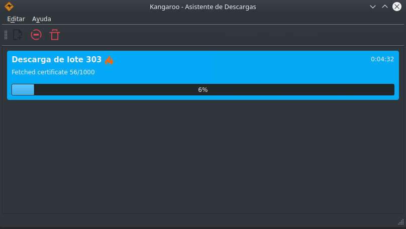
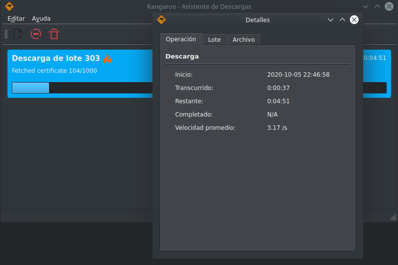

# Kangaroo
### Asistente de descarga de certificados de bachillerato de la SEP

Kangaroo es una librería e interfaz gráfica para facilitar la descarga masiva en paralelo de _datos de certificados del bachillerato mexicano_ en formato JSON


 

 


## Acerca de

Cada vez que un estudiante se gradúa de un bachillerato mexicano registrado con la SEP se genera un certificado que incluye datos como:

- Estudiante
  - Nombre completo
  - Matrícula
- Institución de la que se gradúa
  - Nombre
  - Clave de trabajo
  - RVOE
- Promedio con el que se gradúa
- Periodo en el que se cursaron los estudios
- ID del certificado
- Previo al 2021 también se incluía la CURP

Analizar estos datos puede ser de interés ya que a partir de éstos se pueden observar tendencias y estadísticas, ya sea por estado, institución, o generación, entre otros. Esto se facilita al tener una opción para descargar esta información rápida y efectivamente.

Hecho con:

- [PyQt5](https://pypi.org/project/PyQt5/)
- [RoboBrowser](https://robobrowser.readthedocs.io)


## Características

- Soporte para descargas en paralelo
- Nombre de archivos descargados personalizable
- Cálculo de tiempo estimado de descarga
- Multiplataforma


## Instalación

##### Requisitos

[Python 3.7 & pip][python]

[Pipenv][pipenv]

Git (opcional)


Desde la línea de comando:

Descarga el repositorio

```bash
git clone https://github.com/jacobszpz/Kangaroo.git
cd Kangaroo
```


Para conseguir las dependencias

```bash
pipenv install
```


Para correr el programa

```bash
cd kangaroo
pipenv run python start.py
```


## Licencia

Este programa se distribuye bajo la licencia GPL v2.0, más información en el sitio de la [Free Software Foundation](https://www.gnu.org/licenses/old-licenses/gpl-2.0.html) 

